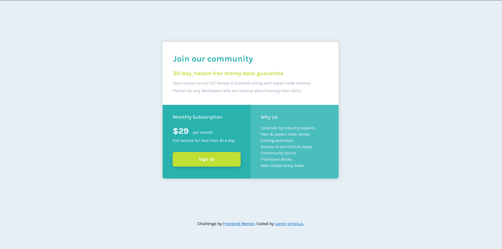

#  Frontend Mentor - Single price grid component 

Esta é uma solução para o [Single price grid component challenge on Frontend Mentor](https://www.frontendmentor.io/challenges/single-price-grid-component-5ce41129d0ff452fec5abbbc). Os desafios do Frontend Mentor ajudam você a melhorar suas habilidades de codificação criando projetos realistas.

##  Índice

- [Visão Geral](#visão-geral)

- [O desafio](#o-desafio)

- [Screenshot](#screenshot)

- [Links](#links)

- [Processo](#processo)

- [Construido com](#construido-com)

- [O que eu aprendi](#o=que-eu-aprendi)

- [Autor](#autor)

##  Visão Geral

###  O desafio

Os usuários devem ser capazes de:

- Visualize o layout ideal para o componente, dependendo do tamanho da tela do dispositivo

- Veja um estado de foco na área de trabalho para a call-to-action Sign Up
###  Screenshot

###  Links

- Solution URL: [https://github.com/Larvin-Vinicius/single-price-grid-component-praticle)

- Live Site URL: [Add live site URL here](https://7sgzg.csb.app/)

##  Processo

###  Construído com

- HTML5 Semântico
- CSS basico
- CSS Grid
- Media queries

###  O que eu aprendi
- Tentei utilizar ao maxima a unidade relativa ***rem***

##  Author

- Twitter - [@yourusername](https://twitter.com/Lrv_s)